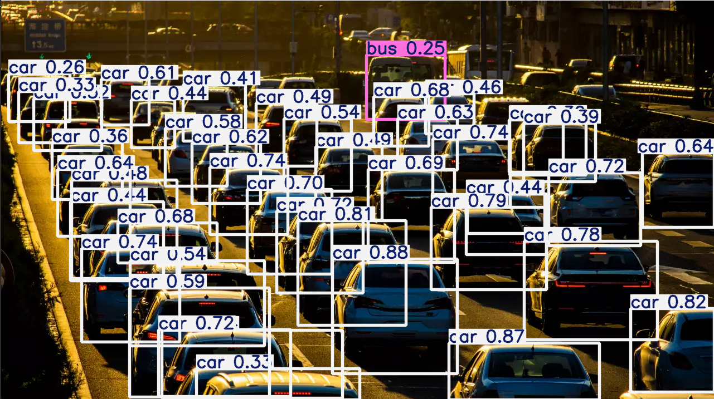

# Object Detection using YOLO

This repository contains a basic object detection implementation using YOLO. The project includes object detection from both images and a webcam feed.

## Example

## Features
- Object detection on static images
- Real-time object detection using a webcam
